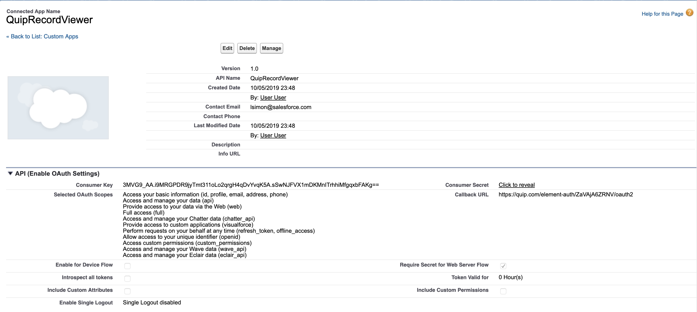

# Salesforce Connected OAuth2

This is a standalone simple demo to show how to connect to your Salesforce instance using a Live App Auth config.

## Create a Live App

1. Go to [https://quip.com/dev/console][]
2. Click "Create a Live App"
3. Copy the App ID into your `app/manifest.json`
4. `npm run build` and then Upload your `app.ele`
5. Refresh, then Create a new Document in Quip and type `@Salesforce OAuth2 Demo` to insert an instance of this app

## Steps to configure Auth

1. Make a Connected App in your Salesforce instance
2. Go to you Live App's Auth screen, add an OAuth2 configuration
    - The Callback URL will be `https://quip.com/element-auth/YOUR-LIVE-APP-ID/oauth2`

3. Make a note of your client ID and secret
4. Go to [https://quip.com/dev/console][]
5. Click on the app you just updated
6. Go to the "Auth" section at the bottom, select OAUTH2 as the auth type and click on "Add"
7. Fill out the auth configuration:
    - **Name**: `oauth2`
    - **Authorization URL**: `https://test.salesforce.com/services/oauth2/authorize`
    - **Token URL**: `https://test.salesforce.com/services/oauth2/token`
    - **Client ID**: your client id from step 2
    - **Client Secret**: your client secret from step 2
    - **Scope**: `full`
    - **Proxy API Domains**: `https://test.salesforce.com https://*.*.my.salesforce.com`
    - **Refresh Token Strategy**: `STANDARD`

