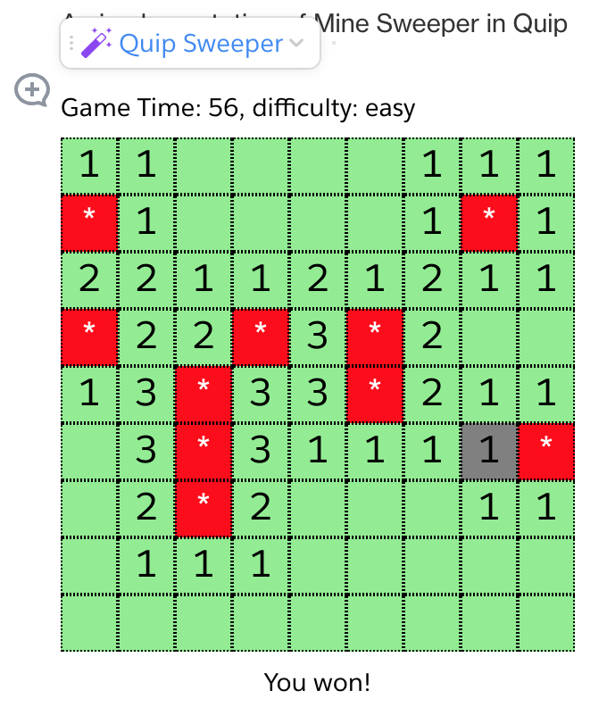

# quip-sweeper
This is an implementation of Mine Sweeper using [VueJS](https://vuejs.org/).



You can use the Quip Live App menu to change the difficulty or to restart at the current difficulty.

Your best time for a particular difficulty level is stored in a [Quip User Preference](https://salesforce.quip.com/dev/liveapps/documentation#preferences).

## Important Information

Check out my [Getting Started Guide](https://github.com/herrevilkitten/quip-getting-started-vue) for detailed information on what changes are made and important caveats.

## Installation
```
git clone https://github.com/herrevilkitten/quip-sweeper
cd quip-sweeper
npm install
```

## Instructions

For the most part, all of the deployment instructions from the [Quip Live App Developer Guide](https://salesforce.quip.com/dev/liveapps/) will also apply to this repository.

To run the development server, use the command

```
npm run start
```

To build a deployable application, use the command
```
npm run build
```

