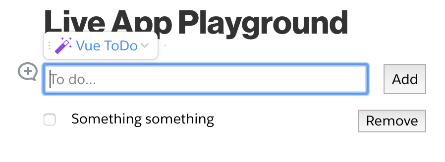
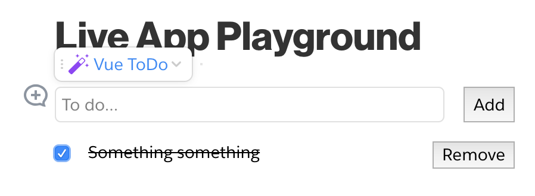
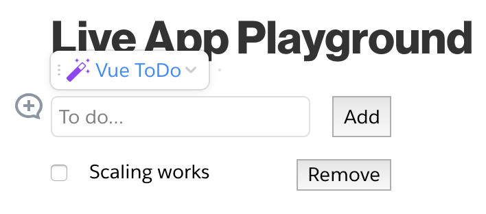

# Vue ToDo
This is a version of the classic "To Do List" that is often used to compare different frameworks and such (for even more examples, see http://todomvc.com/).  This simple app lets you add items to a list, mark them as completed, and remove them.  It stores the item information using Quip Records.

## Important Information

Check out my [Getting Started Guide](https://github.com/herrevilkitten/quip-getting-started-vue) for detailed information on what changes are made and important caveats.

## Installation
```
git clone https://github.com/herrevilkitten/quip-hello-vue
cd quip-hello-vue
npm install
```

## Instructions

For the most part, all of the deployment instructions from the [Quip Live App Developer Guide](https://salesforce.quip.com/dev/liveapps/) will also apply to this repository.

To run the development server, use the command

```
npm run start
```

To build a deployable application, use the command
```
npm run build
```

## Screenshots






